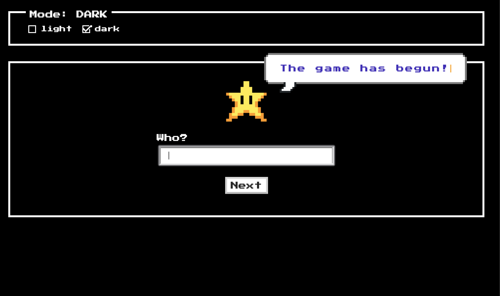

This project was bootstrapped with [Create React App](https://github.com/facebook/create-react-app).

<h1 align="center">Sentence game</h1>

This application is developed as a solution to the  <a href="./CHALLENGE.md" target="_blank">challange</a>.

  

## Devstack is base on the [create-react-app](https://create-react-app.dev/)

- [react](https://reactjs.org/)
- [redux](https://redux.js.org/) - _(I wouldn't use the Redux the useState vs useReducer hooks should be enough, but it is part of the requirement.)_
- [react-testing-library](https://testing-library.com/docs/react-testing-library/intro)

## App features

The app consists of 4 pages:

- Home
- Game
- ResultsBoard
- NotFoud 404

## Available Scripts

In the project directory, you can run:

### `yarn start`

Runs the app in the development mode. 
Open [http://localhost:3000](http://localhost:3000) to view it in the browser.

The page will reload if you make edits. 
You will also see any lint errors in the console.

### `yarn test`

Launches the test runner in the interactive watch mode. 
See the section about [running tests](https://facebook.github.io/create-react-app/docs/running-tests) for more information.

### `yarn run build`

Builds the app for production to the `build` folder. 
It correctly bundles React in production mode and optimizes the build for the best performance.

## TODO

- improve the unit tests
- improve designs
- move more styles values into the theme
- add [Cypress.io](https://www.cypress.io/)
- add storybook
- add more fun features
